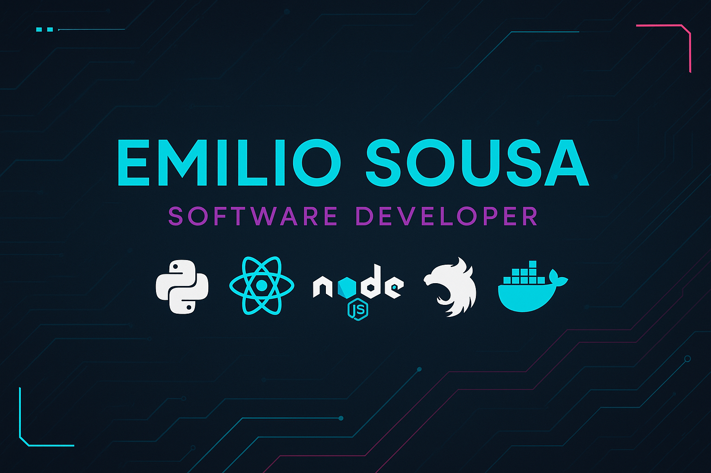

<!-- Banner con estilo -->

#  Hello World! Soy **Emilio Sousa**

 **Estudiante de Ingeniería Informática en la US**  – *este año terminamos inshallah*.  
 Apasionado por el código limpio, el software bien diseñado y los retos tecnológicos.  
 Amante de la automatización, la eficiencia y las soluciones que no solo funcionan… sino que impresionan.  

---

##  Sobre mí

-  21 años, desarrollador full-stack en formación.  
-  Experiencia en **backend, frontend y sistemas**.  
-  Me apasiona crear, aprender y optimizar procesos.  
-  Capaz de trabajar en equipo y también de perderme horas en *debug mode*.  

---

##  Stack Tecnológico

**Lenguajes:**  

**Frameworks & Tools:**  

---

##  Proyectos Destacados

🔹 **[Organization Management con NestJS y Docker](https://github.com/Emiliosousa/Organization-Management-with-NestJS-and-Docker)**  
 Gestión de organizaciones con API REST y despliegue en contenedores.

🔹 **[Snake Game con IA y Arquitectura Cliente-Servidor](https://github.com/Emiliosousa/Snake-Game-with-AI-Agent-and-Client-Server-Architecture)**  
 Clásico con agente inteligente y comunicación en red.

🔹 **[CompSh – Custom Shell Environment](https://github.com/Emiliosousa/CompSh---Custom-Shell-Environment-with-Pipe-Support)**  
 Shell personalizada con soporte de pipes y comandos propios.

---

##  Estadísticas

---

##  Actividad

---

##  Contador de visitas

---

##  Encuéntrame

  
  
 **Email:** emiliosousagutierrez1015@gmail.com  

---
